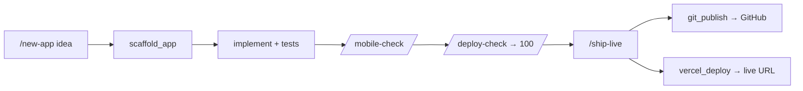
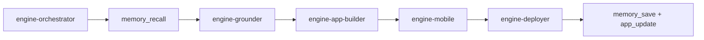
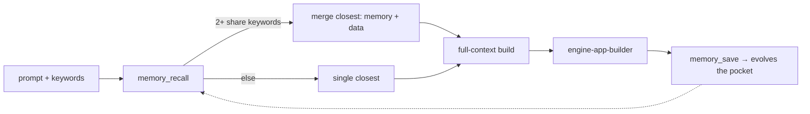
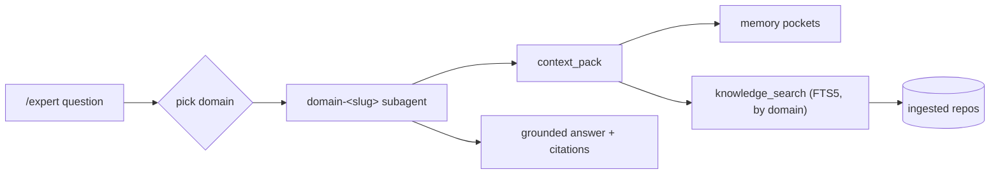
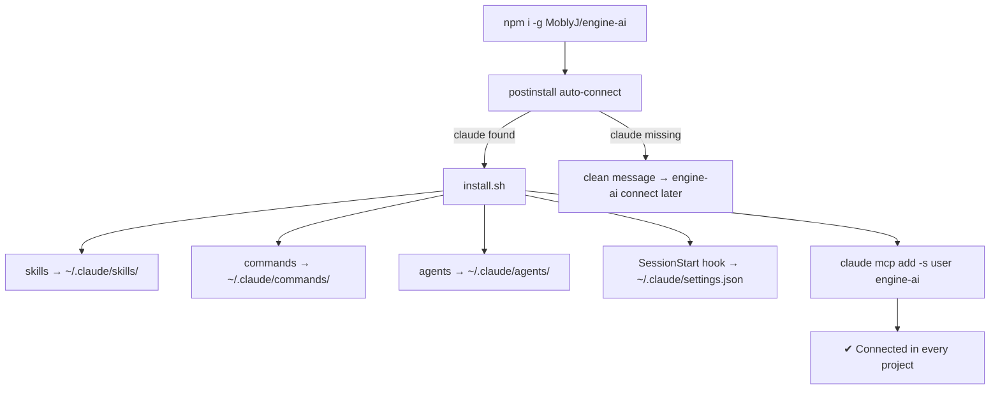

<div align="center">

# ◈ Engine-ai

### Turn your terminal **Claude Code** into a deployable-app factory.
**Build → mobile-check → publish to GitHub → deploy to Vercel — from inside Claude Code.**

[](#-install-one-command)
[](https://docs.claude.com/en/docs/claude-code)
[](https://modelcontextprotocol.io)
[](#)
[](#)
[](LICENSE)

</div>

---

## 🤔 What is it?

`engine-ai` is a **toolkit that plugs into the Claude Code you already run in the terminal**. One npm
command installs it and it **auto-connects** — adding slash commands, skills, and an **MCP server** of
tools your agent can call. You describe an app in plain English; Claude scaffolds it, tests it, checks
mobile responsiveness, and ships it to **GitHub + Vercel**.

> No web dashboard. No cloud account. No heavy dependencies (pure Python stdlib). It lives inside
> Claude Code and works in **WSL / Linux / macOS**.

```
        you (in Claude Code)  ──"build me a landing page"──▶  Claude
                                                                │  calls engine-ai tools
                        ┌───────────────────────────────────────┴───────────────────────────┐
                        ▼                 ▼               ▼                ▼                   ▼
                   scaffold_app     responsive_audit   git_publish     vercel_deploy      deploy_readiness
                   (skeleton+       (mobile check)     (→ GitHub)      (→ live URL)       (ship checklist)
                    tests+Docker)
```

---

## 🚀 Install (one command)

```bash
npm install -g @okoboji/engine-ai
```

That's it — the installer **auto-detects Claude Code and connects itself**. Then **open a new Claude
Code session**. If `engine-ai: command not found` afterward, see the PATH note further down.

> **Published under `@okoboji/engine-ai`, not `engine-ai`** — the bare name `engine-ai` is already
> taken on the npm registry by an unrelated package. This is also a real **npm registry** package now
> (not a git-hosted install), which matters: an earlier version of this README documented a much more
> involved bootstrap command (directory-clearing, retry loops, `--ignore-scripts`) to work around a
> real, reproducible npm race specific to **git-dependency** installs on some filesystems (confirmed on
> WSL2, npm 11) — npm's own lifecycle-script runner would intermittently fail with `ENOENT` under
> several disguises (`spawn sh`, `spawn dash`, `uv_cwd`) while preparing a git-cloned package. Plain
> registry installs use npm's much more standard download-and-extract path and have not reproduced that
> race in testing, so the simple one-liner above is enough.

**Or from a git clone (same full feature set, if you want to build from source):**
```bash
git clone https://github.com/MoblyJ/engine-ai.git && cd engine-ai
npm install        # runs the auto-connect  (or:  ./install.sh)
```

> **All paths install every feature locally** — all MCP tools, skills, the `/agents` subagents, the
> commands, the hook, and the memory engine. Your memory pockets live in `~/.engine-ai/memory.db` and
> grow as you use it. Nothing is cloud-only; everything runs on your machine.

> **Claude Code not installed?** You'll get a clean message and engine-ai waits:
> ```
> ✗ Claude Code was not found on this system.
>   npm install -g @anthropic-ai/claude-code
>   engine-ai connect
> ```

Verify:
```bash
engine-ai doctor        # checks Claude Code + python3 + shows the MCP connection
claude mcp list        # → engine-ai … ✔ Connected
```

---

> **`engine-ai: command not found`?** The integration still works (skills/commands/tools were wired
> in) — only the optional helper CLI isn't on your PATH. npm's global bin dir just isn't on PATH on
> that machine. Fix:
> ```bash
> echo 'export PATH="$(npm prefix -g)/bin:$PATH"' >> ~/.bashrc && source ~/.bashrc
> # or run it directly:  npx engine-ai doctor
> ```

> **New tools / `/agents` / commands not showing after an update?** Claude Code loads them at session
> start. Run `engine-ai connect` (re-links everything + re-registers the MCP), then **open a new
> Claude Code session**. Verify with `claude mcp list` (→ `engine-ai … ✔ Connected`) and
> `engine-ai knowledge status`.

## 🔄 Updates & versioning

`engine-ai` is published to the npm registry as **`@okoboji/engine-ai`** (the bare name `engine-ai` is
taken there by an unrelated package, hence the scope). Every meaningful change is version-bumped,
tagged in git (`vX.Y.Z`), and published as a new registry version, so version numbers are real,
traceable, and installable both ways.

```bash
engine-ai update            # latest published version
engine-ai update 0.13.1     # pin to one exact published version
```

`npm update -g @okoboji/engine-ai` and `npm install -g @okoboji/engine-ai@latest` also work correctly
now — this is a real, legitimately-owned registry package, not a squatted name. `engine-ai update` is
still the recommended path since it does a full clean uninstall + reinstall, which is slightly more
reliable than an in-place update on some filesystems.

Check what you have installed: `engine-ai doctor` prints the running version. Browse all releases
and their notes at https://github.com/MoblyJ/engine-ai/releases, `git tag -l`, or
https://www.npmjs.com/package/@okoboji/engine-ai.

> **Releasing (maintainers):** `npm run release -- <patch|minor|major> "<description>"` bumps
> `package.json`, commits as `vX.Y.Z: <description>`, tags it, pushes both, and best-effort creates
> a GitHub Release. Requires a clean tree on `main`, in sync with `origin/main`. It does **not**
> publish to the npm registry automatically — that still requires `npm publish --access public` with
> either a live OTP (`--otp=<code>`) or an authenticated token, since publishing isn't automated with
> stored credentials on this machine by design.

## 🎮 Use it (inside Claude Code)

| Command | What it does |
|---|---|
| `/new-app <idea>` | Build a **deployable** app in a **hard-isolated git worktree** (own branch + folder) — the orchestrator runs the full A2A loop with memory |
| `/resume-app` | List past app sessions (2-line summary each) and **reopen** one — its worktree folder + memory context restored |
| `/mobile-check [path]` | Audit & fix **mobile responsiveness** |
| `/deploy-check [path]` | Score deployability and fix the gaps |
| `/ground <task>` | Index the repo and work grounded in its real code (RAG) |
| `/ship-live` | **Session-aware** ship: publish the app's worktree/branch to **GitHub** + **Vercel**, verify the URL, record it back to the session |
| `/expert <question>` | Ask one of **30 domain experts** (frontend, system-design, ML, LLM, security…) — grounded in **ingested engineering knowledge** + memory |
| `/knowledge [query]` | **Browse & search** the ingested knowledge store — domains, sources, full-text search with citations |

Or just talk to it: *"build a responsive coffee-shop landing page, then ship it live."*



---

## 🧰 What you get

<table>
<tr><td valign="top">

**Slash commands** (8)
`/new-app` · `/resume-app` · `/expert`
`/knowledge` · `/mobile-check`
`/deploy-check` · `/ground` · `/ship-live`

**Agents** — in `/agents` (36)
`engine-orchestrator` + 5 engine agents
`engine-{app-builder,mobile,deployer,`
`grounder,memory}` · **30 `domain-*`**
**experts** (frontend, system-design,
ml, llm, security, …)

**Skills** — auto-triggered (4)
`deployable-app` · `mobile-responsive`
`publish-and-deploy` · `expert-answer`

</td><td valign="top">

**MCP tools** (27)

🏗️ *Build / ship* — `scaffold_app` ·
`deploy_readiness` · `responsive_audit` ·
`git_publish` · `vercel_deploy`

🔎 *Repo / skills* — `index_repo` ·
`search_repo` · `list_skills` · `get_skill` ·
`import_repo_skills`

🔐 *Secrets* — `set_secret` · `list_secrets`

🧠 *Memory pockets* — `memory_save` ·
`memory_recall` · `memory_context` ·
`memory_list` · `memory_forget`

📦 *App sessions (worktrees)* — `app_create` ·
`app_update` · `app_list` · `app_resume` ·
`app_find`

🎓 *Knowledge swarm* — `knowledge_ingest` ·
`knowledge_search` · `knowledge_domains` ·
`context_pack` · `suggest_experts`

</td></tr>
</table>

---

## 🧑‍🚀 Agents — 36 subagents (in Claude Code `/agents`)

engine-ai installs **36 subagents** into `~/.claude/agents/`: **6 engine agents** (below) that run the
build/ship loop, and **30 `domain-*` experts** (see [Knowledge swarm](#-knowledge-swarm--30-domain-experts-grounded-by-retrieval)).
They show up in Claude Code's `/agents` menu and are invoked either directly or by the orchestrator as
an **agent-to-agent (A2A) loop**. Each has its own context and its own tool set (so it can only do its job).

| Agent | What it does | When it runs | Its tools |
|---|---|---|---|
| 🧭 **engine-orchestrator** | The lead. For any "build/ship an app" request it assembles **full context** and delegates the others in order: recall → ground → build → mobile → ship → save. | `/new-app` or any build request | `Task`, R/W/E, Bash, `memory_recall`/`memory_save`, `index_repo`/`search_repo`, `list_skills`/`get_skill` |
| 🏗️ **engine-app-builder** | Scaffolds, implements, tests, and gates the app to **deploy-readiness 100**. | mid-loop, or "build an app" | `scaffold_app`, `deploy_readiness`, `search_repo`, `set_secret`, `memory_recall` + R/W/E, Bash |
| 📱 **engine-mobile** | Audits & fixes mobile responsiveness; recalls/saves mobile decisions to the session. | mid-loop, or `/mobile-check` | `responsive_audit`, `memory_context`/`recall`/`save`, `app_find`/`app_update` + R/W/E, Bash |
| 🚀 **engine-deployer** | Publishes to **GitHub** + deploys to **Vercel**; asks for the repo name; never bypasses auth. | mid-loop, or `/ship-live` | `git_publish`, `vercel_deploy`, `deploy_readiness` + Read, Bash |
| 🔎 **engine-grounder** | Indexes the repo and returns the relevant code/docs (RAG); saves the grounding to memory. | before edits, or `/ground` | `index_repo`, `search_repo`, `memory_context`/`recall`/`save`, `app_find` + Read, Bash |
| 🧠 **engine-memory** | Recalls & saves keyword-tagged **memory pockets** so apps evolve across prompts. | any time context matters | `memory_recall`/`context`/`save`/`list`/`forget` |

**The A2A loop** the orchestrator runs (each step's output feeds the next; memory bookends every run):


## 📓 Skills — 4 auto-triggered workflows

Skills are methodologies Claude adopts **automatically** from your wording (no command needed). Each
has memory bookends (recall first, save last) so work evolves.

| Skill | What it enforces | Auto-fires when you… |
|---|---|---|
| **deployable-app** | recall + domain knowledge → scaffold → implement → **test** → readiness 100 → mobile → secrets → publish → deploy → save. "Done" only when tests pass, readiness = 100, and the container answers `/healthz`. | ask to build/create an app, API, or site |
| **mobile-responsive** | recall → audit → fix (viewport, `@media` 640/768/1024, fluid units, tap targets ≥44px, responsive images) → verify at 390/768px → save | build/review any UI, or say mobile/responsive/phone |
| **publish-and-deploy** | check tests + readiness → **GitHub** (asks name) → **Vercel** → verify the live URL → save | say push, deploy, go live, or ship |
| **expert-answer** | `suggest_experts` → `context_pack` / domain expert → **cited** recommendation with tradeoffs → save | ask "how should I design/architect/scale/secure…", best practices, or X vs Y |

## ⌨️ Commands — 8 slash commands

Every command shares **one loop**: locate the app session (`app_find`) → **recall** memory → do the
work → **save** memory + update the session. So an app accumulates its branch + folder + memory +
status across all of them.

| Command | Flow |
|---|---|
| `/new-app <idea>` | `app_create` (**git worktree** — own branch + folder) → orchestrator **A2A** build → `memory_save` + `app_update` |
| `/resume-app` | `app_list` (2-line summaries incl. 📱/🚀 status) → pick → `app_resume` (folder + branch + memory restored) |
| `/ground <task>` | `app_find` + `memory_context` → `index_repo` + `search_repo` → `memory_save` (`grounded_files`) |
| `/mobile-check [path]` | `app_find` + `memory_context` → `responsive_audit` → fix → `memory_save` + `app_update` (📱) |
| `/deploy-check [path]` | `app_find` + `memory_context` → `deploy_readiness` → fix to 100 → `memory_save` + `app_update` (🚀) |
| `/ship-live` | `app_find` → gate → `git_publish` + `vercel_deploy` → verify → `memory_save` + `app_update` (URLs) |
| `/expert <q>` | pick domain(s) → delegate to `domain-<slug>` expert(s) → `context_pack` + `knowledge_search` → cited answer |
| `/knowledge [q]` | `knowledge_domains` (browse) or `knowledge_search` (find) → cited hits; open source files under `~/.engine-ai/sources/` |

## 🧰 MCP tools — 27 (the agent calls these; you ask in English)

| Group | Tool | Purpose |
|---|---|---|
| 🏗️ Build/ship | `scaffold_app` | write a deployable skeleton (node-api / python-api / static): server + `/healthz` + tests + Dockerfile + CI + `.env.example` |
| | `deploy_readiness` | score deployability + list exactly what's missing |
| | `responsive_audit` | static mobile-responsiveness score + findings |
| | `git_publish` | create a GitHub repo and push (uses your `gh` login; returns `needs_auth` if not logged in) |
| | `vercel_deploy` | deploy and return the live URL (returns `needs_auth` if not logged in) |
| 🔎 Repo/skills | `index_repo` / `search_repo` | build + query a repo-aware knowledge index (RAG grounding) |
| | `list_skills` / `get_skill` | browse the workflow library |
| | `import_repo_skills` | ingest more `SKILL.md` skills from any repo |
| 🔐 Secrets | `set_secret` / `list_secrets` | encrypted-at-rest secrets vault (lists names only, never values) |
| 🧠 Memory | `memory_save` | save a keyword-tagged pocket; similar keywords **evolve** the existing one |
| | `memory_recall` / `memory_context` | hybrid keyword+embedding recall; merges the closest pockets' memory + data |
| | `memory_list` / `memory_forget` | list / delete pockets |
| 📦 App sessions | `app_create` | start an app in its own **git worktree** (branch + folder) |
| | `app_list` / `app_resume` | list sessions (2-line summaries) / reopen one with folder + memory |
| | `app_update` | save a session's 2-line summary + keywords |
| | `app_find` | which app session a working dir belongs to (for session-aware commands) |
| 🎓 Knowledge | `knowledge_ingest` | clone/ingest a repo into the domain-tagged FTS5 store |
| | `knowledge_search` | BM25 search the ingested knowledge, optionally by domain |
| | `knowledge_domains` | list ingested domains + chunk/repo counts |
| | `context_pack` | **the "perfect context"**: prior memory + retrieved domain knowledge in one blob |
| | `suggest_experts` | deterministic router: request → ranked `domain-<slug>` experts (+ whether each has knowledge) |

---

## 🧠 Memory pockets — apps that *evolve* across prompts

Inspired by **[HelixDB](https://github.com/helixdb/helix-db)** (graph + vector AI memory), reduced to a
tiny Python/SQLite store. Each **pocket** is a chunk of context tagged with **keywords**; recall is
hybrid (keyword overlap **+** embedding similarity). **If two or more pockets share keywords, engine-ai
uses the closest ones and merges BOTH their memory and data** — so every new prompt builds on the last
instead of starting over.



The **engine-orchestrator** runs this as an **agent-to-agent (A2A) loop**: recall memory → ground in
the repo → plan → build → mobile → ship → save memory. Each agent's output feeds the next, so the
final prompt is assembled in **full context**. Stored at `~/.engine-ai/memory.db`.

---

## 🎓 Knowledge swarm — 30 domain experts, grounded by retrieval

engine-ai ships a **swarm of 30 domain-expert subagents** (frontend, backend, devops, cloud,
system-design, distributed-systems, databases, security, api-design, machine-learning, deep-learning,
llm, prompt-engineering, data-engineering, mobile, testing, performance, observability, architecture,
algorithms…). They "master" a field by **retrieval, not training**: you ingest curated engineering
repos into a **domain-tagged SQLite FTS5** store, and the experts answer grounded in it (citing the
source repo + path), plus their evolving memory.

```bash
engine-ai knowledge sync       # clone + ingest the curated repos (system-design, ML, LLM, roadmaps…)
engine-ai knowledge status     # show ingested domains + chunk counts
engine-ai knowledge agents     # regenerate the 30 domain-expert subagents
```
Then, inside Claude Code: `/expert design a scalable rate limiter` → routes to the `domain-system-design`
expert, which `context_pack`s prior memory + retrieved knowledge and answers with citations.



**Routing is deterministic** — `suggest_experts(request)` maps a request to the ranked `domain-<slug>`
experts (and whether each has ingested knowledge), so `/new-app` and `/expert` pick experts repeatably.

**What gets ingested** (curated, practical — **~24k chunks across 23 domains in ~62 MB** from 32 repos):
system-design-primer/101, awesome-system-design, awesome-ML, Prompt-Engineering-Guide, Awesome-LLM,
build-your-own-x, AI/ML-For-Beginners, nn-zero-to-hero, developer-roadmap, **nodebestpractices** (backend),
**Front-End-Checklist / 33-js-concepts** (frontend), **devops-exercises** (devops), **og-aws** (cloud),
**kubernetes-the-hard-way**, **OWASP CheatSheetSeries** (security), **api-guidelines**,
**javascript-testing-best-practices**, **learning-notes** (architecture), Data-Engineering **Cookbook**,
**javascript-algorithms**, and more. Add your own any time: `knowledge_ingest(<repo-url>, "<domain>")`.
Translations, images, and giant binaries are skipped; **multi-TB corpora (The Stack) and model training
are intentionally out of scope** — this is retrieval, done locally.

> **Design note** — mirrors Anthropic's Managed Agents / Agent SDK patterns, mapped local:
> **agent** → subagent definition · **environment** → git worktree · **session** → app session
> (`sessions.db`) · **memory store** → memory pockets (the cross-agent bridge) · **context isolation**
> → each subagent gets explicit `context_pack` input, not the parent conversation.

### `/expert` in action

> **You:** `/expert How should I design a scalable rate limiter for an API?`

`suggest_experts` routes it → **domain-system-design** (1.2k chunks) + **domain-backend** (2.8k). The
expert grounds its answer in the ingested store and **cites every sourced claim**:

- Enforce volumetric limits at the edge (nginx); per-key/route logic in shared middleware — `nodebestpractices/…/limitrequests.md`
- Shared **Redis** counters (atomic) + `trust proxy` for the true client IP — same source
- Cheap check before expensive validation · fail-open on Redis outage · Redis-as-SPOF — `CheatSheetSeries/…/Denial_of_Service_Cheat_Sheet.md`
- Token-bucket vs sliding-window tradeoffs — answered from first principles, and it **flags** that the
  store is thin on algorithm internals (and suggests `knowledge_ingest(...)` to fill it).

That's the whole loop: **routed → grounded → cited → honest about gaps.**

---

## 🏗️ How it connects



### What `connect` / `install.sh` actually does (the actions)
| Action | Effect | Where |
|---|---|---|
| detect | checks WSL + Claude Code (`claude`) + `python3`; clean error + stop if Claude Code is missing | — |
| link **skills** | symlinks each `skills/<name>/` | `~/.claude/skills/` |
| link **commands** | symlinks each `commands/*.md` (the 6 slash commands) | `~/.claude/commands/` |
| link **agents** | symlinks each `agents/*.md` (the 6 subagents → show in `/agents`) | `~/.claude/agents/` |
| install **hook** | merges a `SessionStart` hook (backs up `settings.json` first) | `~/.claude/settings.json` |
| register **MCP** | `claude mcp add -s user engine-ai -- python3 …/mcp/forge_mcp.py` (all 22 tools) | user scope |

Everything installs at **user scope**, so it's available in **every folder** you open Claude Code in.
It's **idempotent** (re-runs are safe) and **fully reversible** (`engine-ai uninstall`).

---

## 🪝 The activation hook (SessionStart)

engine-ai installs one Claude Code hook — `hooks/session-start.sh`, wired into `~/.claude/settings.json`
as a **SessionStart** hook. On **every new session** it injects a short context block telling Claude the
toolkit is active and listing the tools, commands, and skills — so Claude reaches for the right one
without you having to remind it. It's the only hook engine-ai adds, it emits valid JSON (degrades
gracefully if `jq` is missing, via `python3`), and it's removed on `engine-ai uninstall`.

```
SessionStart ──▶ session-start.sh ──▶ "engine-ai is ACTIVE — tools: scaffold_app, deploy_readiness,
                                       responsive_audit, git_publish, vercel_deploy, memory_*, app_* …
                                       commands: /new-app /resume-app /mobile-check /deploy-check
                                       /ground /ship-live ; skill: deployable-app"
```

---

## 🗂️ Where things live (local data)

| Path | What |
|---|---|
| `~/.claude/{skills,commands,agents}/` | the symlinked skills / commands / subagents |
| `~/.claude/settings.json` | the SessionStart hook (with timestamped backups) |
| `~/.engine-ai/memory.db` | 🧠 memory pockets (keyword-tagged evolving context) |
| `~/.engine-ai/sessions.db` | 📦 app sessions (name, path, branch, 2-line summary) |
| `~/.engine-ai/workspace/` | central git repo that app worktrees branch from |
| `~/.engine-ai/apps/<slug>/` | each app's **git worktree** (own branch + folder) |
| `~/.engine-ai/forge.db` | repo RAG index |
| `~/.engine-ai/knowledge.db` | 🎓 domain-tagged knowledge (FTS5) for the expert swarm |
| `~/.engine-ai/sources/<repo>/` | shallow clones of the ingested knowledge repos |

Nothing is cloud-only — it all runs and persists on your machine.

---

## 🔑 GitHub & Vercel (for `/ship-live`)

These need their own login (once per machine):

```bash
gh auth login       # GitHub  (engine-ai uses your gh session)
vercel login        # Vercel
```

> `engine-ai` reuses your **`gh` login in WSL** to create + push repos. There is no way to reuse the
> Google account connected to Claude for GitHub — GitHub needs its own auth.

---

## 🧪 Verified

Pure-stdlib test suite (`python3 -m unittest discover -s tests`): **46 tests** — MCP protocol (27
tools), scaffolding (node/python/static), RAG index+search, secrets vault, mobile-responsive audit,
GitHub/Vercel auth guards, **memory pockets** (keyword recall + merge-on-similar + evolving context),
**app sessions** (git worktree per app · 2-line summaries · resume-with-memory · `app_find`),
**knowledge store** (FTS5 ingest · domain-filtered BM25 search · translation skip · `context_pack`),
and the installer (idempotent · preserves settings · clean uninstall · fails cleanly with no Claude Code).

---

## 🧹 Manage

```bash
engine-ai connect            # (re)connect to Claude Code
engine-ai doctor             # prerequisites + status
engine-ai knowledge sync     # clone + ingest the curated engineering repos
engine-ai knowledge status   # ingested domains + chunk counts
engine-ai knowledge agents   # regenerate the 30 domain-expert subagents
engine-ai uninstall          # remove from Claude Code (also runs on npm rm -g)
```

---

## 📦 Moving to another PC

Copy the folder (or `npm i -g MoblyJ/engine-ai` again), then it auto-connects. Logins (`gh`, `vercel`)
are per-machine. See `docs/USING-IN-CLAUDE-CODE.md`.

<div align="center"><sub>MIT · built for Claude Code · by <a href="https://github.com/MoblyJ">MoblyJ</a></sub></div>
