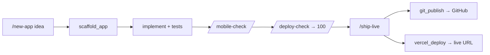
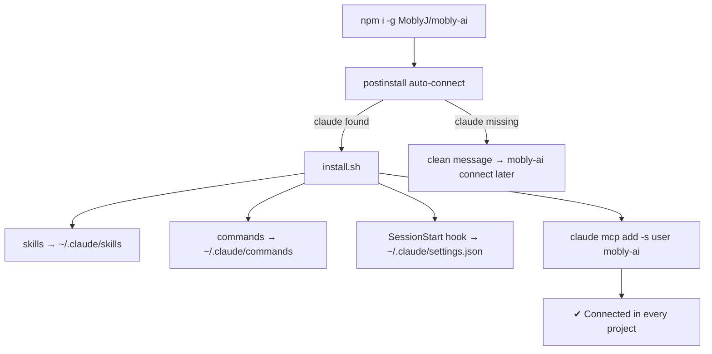

<div align="center">

# ◈ mobly-ai

### Turn your terminal **Claude Code** into a deployable-app factory.
**Build → mobile-check → publish to GitHub → deploy to Vercel — from inside Claude Code.**

[](#-install-one-command)
[](https://docs.claude.com/en/docs/claude-code)
[](https://modelcontextprotocol.io)
[](#)
[](#)
[](LICENSE)

</div>

---

## 🤔 What is it?

`mobly-ai` is a **toolkit that plugs into the Claude Code you already run in the terminal**. One npm
command installs it and it **auto-connects** — adding slash commands, skills, and an **MCP server** of
tools your agent can call. You describe an app in plain English; Claude scaffolds it, tests it, checks
mobile responsiveness, and ships it to **GitHub + Vercel**.

> No web dashboard. No cloud account. No heavy dependencies (pure Python stdlib). It lives inside
> Claude Code and works in **WSL / Linux / macOS**.

```
        you (in Claude Code)  ──"build me a landing page"──▶  Claude
                                                                │  calls mobly-ai tools
                        ┌───────────────────────────────────────┴───────────────────────────┐
                        ▼                 ▼               ▼                ▼                   ▼
                   scaffold_app     responsive_audit   git_publish     vercel_deploy      deploy_readiness
                   (skeleton+       (mobile check)     (→ GitHub)      (→ live URL)       (ship checklist)
                    tests+Docker)
```

---

## 🚀 Install (one command)

```bash
npm install -g MoblyJ/mobly-ai
```

That's it — the installer **auto-detects Claude Code and connects itself**. Then **open a new Claude
Code session**.

> **Claude Code not installed?** You'll get a clean message and mobly-ai waits:
> ```
> ✗ Claude Code was not found on this system.
>   npm install -g @anthropic-ai/claude-code
>   mobly-ai connect
> ```

Verify:
```bash
mobly-ai doctor        # checks Claude Code + python3 + shows the MCP connection
claude mcp list        # → mobly-ai … ✔ Connected
```

---

## 🎮 Use it (inside Claude Code)

| Command | What it does |
|---|---|
| `/new-app <idea>` | Scaffold + build a **deployable** app end to end |
| `/mobile-check [path]` | Audit & fix **mobile responsiveness** |
| `/deploy-check [path]` | Score deployability and fix the gaps |
| `/ground <task>` | Index the repo and work grounded in its real code (RAG) |
| `/ship-live` | Push to **GitHub** + deploy to **Vercel**, then verify the live URL |

Or just talk to it: *"build a responsive coffee-shop landing page, then ship it live."*



---

## 🧰 What you get

<table>
<tr><td>

**Slash commands**
`/new-app` · `/mobile-check`
`/deploy-check` · `/ground` · `/ship-live`

</td><td>

**Skills** (auto-triggered)
`deployable-app` · `mobile-responsive`
`publish-and-deploy`

</td><td>

**MCP tools** (12)
`scaffold_app` · `deploy_readiness`
`responsive_audit` · `git_publish`
`vercel_deploy` · `index_repo`
`search_repo` · `list/get_skill`
`set/list_secret` · `import_repo_skills`

</td></tr>
</table>

---

## 🏗️ How it connects



Everything installs at **user scope**, so it's available in **every folder** you open Claude Code in.

---

## 🔑 GitHub & Vercel (for `/ship-live`)

These need their own login (once per machine):

```bash
gh auth login       # GitHub  (mobly-ai uses your gh session)
vercel login        # Vercel
```

> `mobly-ai` reuses your **`gh` login in WSL** to create + push repos. There is no way to reuse the
> Google account connected to Claude for GitHub — GitHub needs its own auth.

---

## 🧪 Verified

Pure-stdlib test suite (`python3 -m unittest discover -s tests`): **19 tests** — MCP protocol,
scaffolding (node/python/static), RAG index+search, secrets vault, mobile-responsive audit,
GitHub/Vercel auth guards, and the installer (idempotent · preserves settings · clean uninstall ·
fails cleanly with no Claude Code).

---

## 🧹 Manage

```bash
mobly-ai connect      # (re)connect to Claude Code
mobly-ai doctor       # prerequisites + status
mobly-ai uninstall    # remove from Claude Code (also runs on npm rm -g)
```

---

## 📦 Moving to another PC

Copy the folder (or `npm i -g MoblyJ/mobly-ai` again), then it auto-connects. Logins (`gh`, `vercel`)
are per-machine. See `docs/USING-IN-CLAUDE-CODE.md`.

<div align="center"><sub>MIT · built for Claude Code · by <a href="https://github.com/MoblyJ">MoblyJ</a></sub></div>
