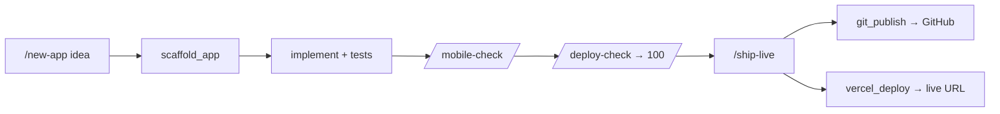
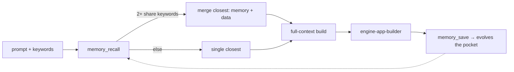

<div align="center">

# ◈ Engine-ai

### Turn your terminal **Claude Code** into a deployable-app factory.
**Build → mobile-check → publish to GitHub → deploy to Vercel — from inside Claude Code.**

[](#-install-one-command)
[](https://docs.claude.com/en/docs/claude-code)
[](https://modelcontextprotocol.io)
[](#)
[](#)
[](LICENSE)

</div>

---

## 🤔 What is it?

`engine-ai` is a **toolkit that plugs into the Claude Code you already run in the terminal**. One npm
command installs it and it **auto-connects** — adding slash commands, skills, and an **MCP server** of
tools your agent can call. You describe an app in plain English; Claude scaffolds it, tests it, checks
mobile responsiveness, and ships it to **GitHub + Vercel**.

> No web dashboard. No cloud account. No heavy dependencies (pure Python stdlib). It lives inside
> Claude Code and works in **WSL / Linux / macOS**.

```
        you (in Claude Code)  ──"build me a landing page"──▶  Claude
                                                                │  calls engine-ai tools
                        ┌───────────────────────────────────────┴───────────────────────────┐
                        ▼                 ▼               ▼                ▼                   ▼
                   scaffold_app     responsive_audit   git_publish     vercel_deploy      deploy_readiness
                   (skeleton+       (mobile check)     (→ GitHub)      (→ live URL)       (ship checklist)
                    tests+Docker)
```

---

## 🚀 Install (one command)

```bash
npm install -g MoblyJ/engine-ai
```

That's it — the installer **auto-detects Claude Code and connects itself**. Then **open a new Claude
Code session**.

**Or from a git clone (same full feature set):**
```bash
git clone https://github.com/MoblyJ/engine-ai.git && cd engine-ai
npm install        # runs the auto-connect  (or:  ./install.sh)
```

> **Both paths install every feature locally** — all MCP tools, skills, the `/agents` subagents, the
> commands, the hook, and the memory engine. Your memory pockets live in `~/.engine-ai/memory.db` and
> grow as you use it. Nothing is cloud-only; everything runs on your machine.

> **Claude Code not installed?** You'll get a clean message and engine-ai waits:
> ```
> ✗ Claude Code was not found on this system.
>   npm install -g @anthropic-ai/claude-code
>   engine-ai connect
> ```

Verify:
```bash
engine-ai doctor        # checks Claude Code + python3 + shows the MCP connection
claude mcp list        # → engine-ai … ✔ Connected
```

---

> **`engine-ai: command not found`?** The integration still works (skills/commands/tools were wired
> in) — only the optional helper CLI isn't on your PATH. npm's global bin dir just isn't on PATH on
> that machine. Fix:
> ```bash
> echo 'export PATH="$(npm prefix -g)/bin:$PATH"' >> ~/.bashrc && source ~/.bashrc
> # or run it directly:  npx engine-ai doctor
> ```

## 🎮 Use it (inside Claude Code)

| Command | What it does |
|---|---|
| `/new-app <idea>` | Build a **deployable** app in an **isolated session** — own workspace + the orchestrator agent runs the full A2A loop with memory |
| `/mobile-check [path]` | Audit & fix **mobile responsiveness** |
| `/deploy-check [path]` | Score deployability and fix the gaps |
| `/ground <task>` | Index the repo and work grounded in its real code (RAG) |
| `/ship-live` | Push to **GitHub** + deploy to **Vercel**, then verify the live URL |

Or just talk to it: *"build a responsive coffee-shop landing page, then ship it live."*



---

## 🧰 What you get

<table>
<tr><td>

**Slash commands**
`/new-app` · `/mobile-check`
`/deploy-check` · `/ground` · `/ship-live`

</td><td>

**Skills** (auto-triggered)
`deployable-app` · `mobile-responsive`
`publish-and-deploy`

</td><td>

**MCP tools** (12)
`scaffold_app` · `deploy_readiness`
`responsive_audit` · `git_publish`
`vercel_deploy` · `index_repo`
`search_repo` · `list/get_skill`
`set/list_secret` · `import_repo_skills`

</td></tr>
</table>

---

## 🤖 What each agent does

Engine-ai adds **specialist agents (skills)** that Claude adopts automatically, **slash commands** you
trigger, and **MCP tools** the agent calls under the hood.

### Agents (skills — auto-triggered by what you ask)
| Agent | What it does | Fires when you… |
|---|---|---|
| 🏗️ **deployable-app** | Builds a complete app end-to-end: scaffold → implement → **test** → mobile check → deploy-readiness → ship. Won't call it "done" until tests pass, readiness = 100, and the container answers `/healthz`. | ask to build/create an app, API, service, or site |
| 📱 **mobile-responsive** | Audits & fixes mobile UX — viewport, breakpoints, fluid layout, tap targets, responsive images — and verifies at phone/tablet widths. | build/review any UI, or mention mobile/responsive/phone |
| 🚀 **publish-and-deploy** | Takes a tested app → **GitHub repo** (asks you the name) → **Vercel** live URL → verifies the URL responds. | say push to GitHub, deploy, go live, or ship |

### Commands (you type these in Claude Code)
| Command | Does |
|---|---|
| `/new-app <idea>` | scaffold + build a deployable app |
| `/mobile-check [path]` | audit & fix mobile responsiveness |
| `/deploy-check [path]` | score deployability + fix gaps |
| `/ground <task>` | index the repo, work grounded in its real code (RAG) |
| `/ship-live` | publish to GitHub + deploy to Vercel |

### Tools (the agent calls these — you just ask in English)
| Tool | Purpose |
|---|---|
| `scaffold_app` | write a deployable skeleton (node-api / python-api / static): server + healthcheck + tests + Dockerfile + CI |
| `deploy_readiness` | score deployability + list exactly what's missing |
| `responsive_audit` | static mobile-responsiveness score + findings |
| `git_publish` | create a GitHub repo and push (uses your `gh` login) |
| `vercel_deploy` | deploy and return the live URL |
| `index_repo` / `search_repo` | build + query a repo-aware knowledge index (RAG grounding) |
| `list_skills` / `get_skill` | browse the workflow library |
| `import_repo_skills` | ingest more `SKILL.md` skills from any repo |
| `set_secret` / `list_secrets` | encrypted secrets vault (names-only listing) |
| `memory_save` / `memory_recall` / `memory_context` | 🧠 **memory pockets** — keyword-tagged evolving context (see below) |

> **These agents also appear in Claude Code's `/agents` menu** — engine-ai installs them as subagents
> in `~/.claude/agents/` (`engine-orchestrator`, `engine-app-builder`, `engine-mobile`,
> `engine-deployer`, `engine-grounder`, `engine-memory`).

---

## 🧠 Memory pockets — apps that *evolve* across prompts

Inspired by **[HelixDB](https://github.com/helixdb/helix-db)** (graph + vector AI memory), reduced to a
tiny Python/SQLite store. Each **pocket** is a chunk of context tagged with **keywords**; recall is
hybrid (keyword overlap **+** embedding similarity). **If two or more pockets share keywords, engine-ai
uses the closest ones and merges BOTH their memory and data** — so every new prompt builds on the last
instead of starting over.



The **engine-orchestrator** runs this as an **agent-to-agent (A2A) loop**: recall memory → ground in
the repo → plan → build → mobile → ship → save memory. Each agent's output feeds the next, so the
final prompt is assembled in **full context**. Stored at `~/.engine-ai/memory.db`.

---

## 🏗️ How it connects


Everything installs at **user scope**, so it's available in **every folder** you open Claude Code in.

---

## 🔑 GitHub & Vercel (for `/ship-live`)

These need their own login (once per machine):

```bash
gh auth login       # GitHub  (engine-ai uses your gh session)
vercel login        # Vercel
```

> `engine-ai` reuses your **`gh` login in WSL** to create + push repos. There is no way to reuse the
> Google account connected to Claude for GitHub — GitHub needs its own auth.

---

## 🧪 Verified

Pure-stdlib test suite (`python3 -m unittest discover -s tests`): **19 tests** — MCP protocol,
scaffolding (node/python/static), RAG index+search, secrets vault, mobile-responsive audit,
GitHub/Vercel auth guards, and the installer (idempotent · preserves settings · clean uninstall ·
fails cleanly with no Claude Code).

---

## 🧹 Manage

```bash
engine-ai connect      # (re)connect to Claude Code
engine-ai doctor       # prerequisites + status
engine-ai uninstall    # remove from Claude Code (also runs on npm rm -g)
```

---

## 📦 Moving to another PC

Copy the folder (or `npm i -g MoblyJ/engine-ai` again), then it auto-connects. Logins (`gh`, `vercel`)
are per-machine. See `docs/USING-IN-CLAUDE-CODE.md`.

<div align="center"><sub>MIT · built for Claude Code · by <a href="https://github.com/MoblyJ">MoblyJ</a></sub></div>
